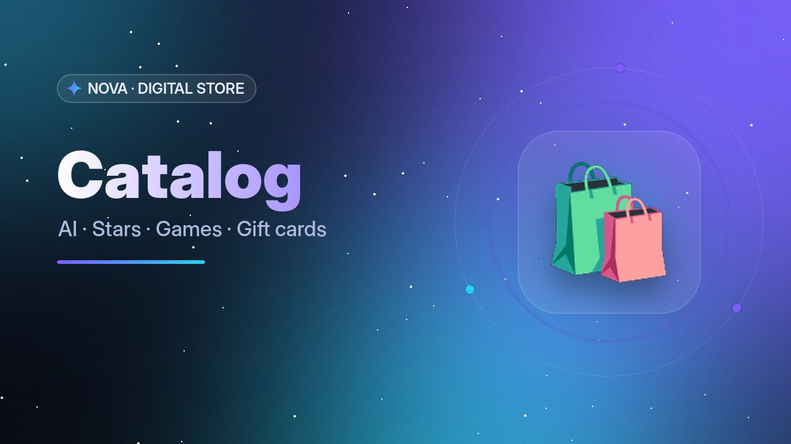

# ✨ NOVA Store — Telegram-магазин цифровых товаров

Готовый к запуску бот-магазин на **pyTelegramBotAPI (AsyncTeleBot) + aiosqlite**: подписки на нейросети
(ChatGPT, Claude, Gemini, Perplexity, Grok, Midjourney, Cursor), Telegram Stars и Premium, пополнение Steam,
игровая валюта, подарочные карты — и вообще любые цифровые товары.

**Всё настраивается в админ-панели внутри бота.** В `config.py` только токен и ваш Telegram ID.

<p align="center"> </p>

---

## 🚀 Запуск за 3 шага

```bash
git clone <repo> nova-shop && cd nova-shop
nano config.py          # BOT_TOKEN = "123:ABC..."   OWNER_IDS = [ваш_id]
python3 main.py         # недостающие библиотеки установятся сами
```

1. Токен — у [@BotFather](https://t.me/BotFather), свой ID — у [@userinfobot](https://t.me/userinfobot).
2. Запустите `python3 main.py`. Бот сам создаст базу, демо-каталог, фирменные баннеры, команды и описание
   на 8 языках и пришлёт вам сообщение «🚀 запущен».
3. Откройте бота и отправьте **/admin**. В каждом разделе есть кнопка **📖 Инструкция**.

Нужен Python 3.10+. Переменные окружения не используются.

---

## 🛍 Что умеет магазин

| | |
|---|---|
| **Каталог** | Вложенные разделы (Нейросети → ChatGPT → тарифы), карточки с описанием, гарантией, наличием и счётчиком продаж, фото/GIF/видео на каждом экране |
| **Автовыдача** | Ключи, ссылки, аккаунты со склада — моментально после оплаты. Если ключи кончились, заказ встаёт в очередь и **выдаётся сам**, как только вы добавите ключи |
| **Любое количество** | Звёзды 50–35 000 ⭐, пополнение Steam на любую сумму, UC: быстрые кнопки + ввод любого числа |
| **Данные покупателя** | @username получателя (с кнопкой «Себе»), логин Steam, ID игрока, e-mail аккаунта |
| **Выдача через API** | Бот сам вызывает API поставщика (звёзды/Premium/пополнения); при ошибке — ручная очередь |
| **Ручная выдача** | Уведомление админу с кнопкой «Выдать» |
| **Баланс** | Пополнение любым способом, оплата в один клик, возвраты и реферальные бонусы на баланс |
| **Промокоды** | Скидка в %, лимит использований, один раз на покупателя |
| **Рефералка** | % с каждой покупки приглашённых — на баланс |
| **Поддержка** | Тикеты прямо в боте: сообщение → админу → ответ от имени бота |
| **Обязательная подписка** | На канал, с проверкой и кэшем |
| **8 языков** | 🇬🇧 🇷🇺 🇺🇦 🇪🇸 🇧🇷 🇩🇪 🇫🇷 🇹🇷 — автоопределение, описания товаров на каждый язык |
| **Уведомления** | Продажи, заказы к выдаче, проверка оплат, мало ключей, ошибки платёжек |

## 💳 Способы оплаты

Подключаются в **/admin → 💳 Оплата**: откройте способ → вставьте ключи → «Проверить подключение» → «Включить».
Суммы автоматически пересчитываются из валюты магазина (курс ЦБ, TON, ⭐). Для каждого способа можно задать
комиссию/скидку в % и своё название кнопки. Одинаковых способов может быть несколько («СБП», «СБП 2»).

| Способ | Подтверждение | Где взять ключи |
|---|---|---|
| ⭐ **Telegram Stars** | авто | ничего не нужно — работает сразу |
| 💎 **CryptoBot** | авто | [@CryptoBot](https://t.me/CryptoBot) → Crypto Pay → Create App → API Token |
| 🚀 **xRocket** | авто | [@xRocket](https://t.me/xrocket) → Rocket Pay → создать приложение → API-ключ |
| 💠 **TON на кошелёк** | авто (по комментарию) | только адрес кошелька |
| 🪙 **Heleket / Cryptomus** | авто | кабинет → Merchant → API: Merchant ID + payment key |
| 🏦 **ЮKassa** (СБП, карты) | авто | yookassa.ru → Интеграция → Ключи API: shopId + секретный ключ |
| 💳 **Pally / Paypalych / Cardlink** (СБП, карты) | авто | кабинет → магазин: API-токен + ID магазина |
| 🌐 **Универсальный API** | авто | **любой** сервис с API (Cashera, Paycore, Lava, AAIO, FreeKassa…) — описывается JSON прямо в админке |
| 🏦 **Ручной перевод** | админ подтверждает чек | любые реквизиты: СБП по номеру, карта, PayPal, IBAN, USDT… |
| 💰 **Баланс** | мгновенно | — |

Проверка платежей идёт в фоне (раз в ~12 с) и по кнопке «Проверить оплату». Webhook-сервер не нужен.

## ⚙️ Админ-панель (/admin)

- **📦 Товары** — разделы и подразделы, товары: цена, описание и инструкция на каждый язык, количество,
  данные покупателя, способ выдачи, картинка, вкл/выкл, порядок, перемещение, прямые ссылки для постов.
- **🔑 Ключи** — загрузка сообщением или `.txt` файлом (по одному в строке, многострочные через `---`),
  дубли пропускаются, выгрузка и очистка.
- **🧾 Заказы** — «в работе» (выдать / проверить оплату), история, ручная выдача, возврат звёзд или на
  баланс, повторная отправка, `/order 123`.
- **💳 Оплата** — все способы выше с инструкциями.
- **👥 Пользователи** — поиск, баланс (`+10`, `-5`, `=20`), бан, сообщение от имени бота, заказы.
- **🎟 Промокоды**, **📢 Рассылка** (любой тип сообщения, кнопка-ссылка, сегменты, отчёт).
- **🎨 Дизайн** — замена любого баннера своим фото/GIF/видео, название магазина, текст приветствия.
- **⚙️ Настройки** — валюта, язык, поддержка, канал, техработы, рефералка, лимиты, курсы.
- **🛡 Защита**, **👮 Админы** (права по разделам), **🖥 Система** (память, бэкап базы, курсы).

## 🛡 Защита и производительность

Перенесены подходы из `gena.py` / `ban.py`:

- чёрный список в памяти, лимиты в скользящем окне, игнор двойных нажатий;
- эмодзи-капча при флуде (и опционально для новых), нарастающий автомут 5 мин → 30 мин → 2 ч → 24 ч;
- действия одного пользователя выполняются строго по очереди — двойной заказ невозможен;
- лимит неоплаченных заказов, лимиты длины ввода, игнор групп и ботов;
- backpressure опроса Telegram, ограниченные TTL/LRU-кэши, отслеживаемые фоновые задачи;
- `mallopt` + периодический `gc`/`malloc_trim`, aiosqlite с WAL и `synchronous=NORMAL`, uvloop;
- баннеры загружаются один раз и дальше отправляются по `file_id`, экраны редактируются на месте;
- токены и ключи маскируются в логах, секретные ключи удаляются из чата после ввода;
- ожидающие апдейты не пропускаются при перезапуске — оплаты не теряются.

## 🖥 Деплой на сервер

**systemd** (рекомендуется):
```bash
sudo cp -r . /opt/nova-shop && cd /opt/nova-shop
sudo cp nova-shop.service /etc/systemd/system/
sudo systemctl enable --now nova-shop
journalctl -u nova-shop -f            # логи
```

**Docker:**
```bash
docker compose up -d --build
```

База — один файл `data/shop.db`. Резервная копия: **/admin → 🖥 Система → 💾 Бэкап базы**.

## 🎨 Дизайн

Фирменный стиль NOVA: 21 баннер (`assets/*.jpg`) и 2 анимации (`main.mp4`, `success.mp4`).
Перегенерировать под своё название:
```bash
pip install Pillow && python tools/make_assets.py --name "MY STORE"
```
Или просто замените любой экран в **/admin → 🎨 Дизайн**.

## 🧪 Тесты

```bash
pip install -r requirements-dev.txt
python -m pytest -q
```
70 сквозных тестов прогоняют настоящие обработчики через поддельный Telegram API (без сети), который
проверяет то же, что проверил бы Telegram: HTML-разметку, лимиты длины, `callback_data`. Покрыты покупки
всеми способами оплаты, очередь при нехватке ключей, количество и получатель, промокоды, рефералы, возвраты,
все экраны админки на ru/en, все экраны покупателя на 8 языках, антиспам, капча, запуск и опрос.

## 📁 Структура

```
config.py               токен и ID владельца — единственное, что нужно заполнить
main.py                 запуск + автоустановка зависимостей
shop/
  app.py                старт, команды, фоновые задачи, опрос
  db.py                 aiosqlite: схема, миграции, запросы
  settings.py           настройки из админки (кэш в памяти)
  antispam.py           middleware защиты
  payments/             провайдеры: builtin, crypto, fiat, custom (универсальный API)
  services/             заказы и выдача, оплата, курсы, цены, уведомления, фоновые задачи
  handlers/             экраны покупателя + admin/ (админ-панель)
  locales/              8 языков + тексты и инструкции админки (ru/en)
  seed.py               стартовый каталог
assets/                 баннеры и анимации
tools/make_assets.py    генератор дизайна
tests/                  e2e-тесты
```

## ❓ Частые вопросы

**Как вывести звёзды?** @BotFather → ваш бот → Balance (через Fragment). Telegram требует продавать цифровые
товары внутри Telegram за Stars — поэтому Stars включены по умолчанию.

**Как поменять валюту?** /admin → ⚙️ Настройки → Магазин → Валюта. Цены не пересчитываются автоматически —
обновите их после смены.

**Как продавать звёзды/Premium автоматически?** Товар → 🚚 Выдача → «Через API» и вставьте JSON с адресом API
вашего поставщика (пример — прямо в админке). Либо оставьте ручную выдачу.

**Где логи?** В консоли / `journalctl`. Ключи и токены в логах заменяются на `***`.

> Владелец магазина сам отвечает за соблюдение законов своей страны и правил сервисов, подписки которых продаёт.
